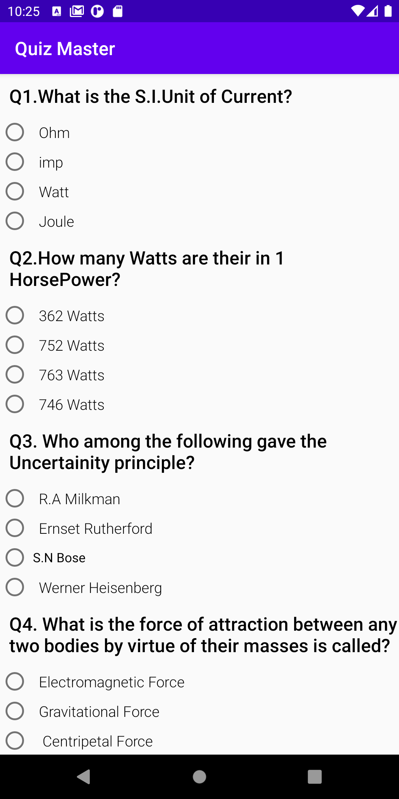

# Android Game Quiz App for Udacity
## Quiz-Master
- Project **Quiz App** of Android Basics Nanodegree
- [Android Basics Nanodegree at Udacity.com]

## Android Goodies
- View items: Checkboxes, radio buttons and EditText.

# Description 
- 7 Question's quizz App
- It had to contain radio buttons, checkboxes and EditText 
- Final score is shown with a Toast

# Screenshot

